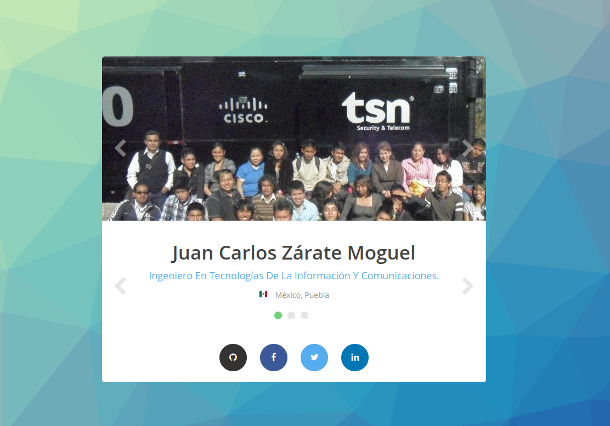

# Tarjeta de Presentación.

Plantilla realizada mientras tomaba un curso en YouTube.

## Tecnologías

1. HTML5
2. CSS3
3. JS
4. NGNIX

## Échale un vistazo

+ [Docker hub](https://hub.docker.com/r/jkarlozdhub/tarjetapresentacion) - Consulta el repositorio y descárgate el contenedor o simplemente ejecuta la siguiente línea en tu Docker.

`docker run -dp 3030:80 --name presentacion jkarlozdhub/tarjetapresentacion:v1`

+ [Azure web site](https://tarjetapresentacion.azurewebsites.net/) - también puedes ir directo al sitio alojado en Azure
