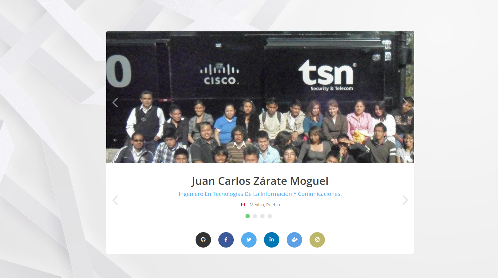

# Tarjeta de Presentación v2.0.

Realice esta plantilla siguiendo el video en YouTube [Tutorial Tarjeta de Presentación / Portafolio con HTML, CSS y JS (Jquery)](https://www.youtube.com/watch?v=kyeuKf9Acwo), he realizado pequeñas modificaciones para actualizar mis datos.

## Tecnologías

1. HTML5
2. CSS3
3. JS
4. NGNIX

## Échale un vistazo

+ [Docker hub](https://hub.docker.com/r/jkarlozdhub/tarjetapresentacion) - Consulta el repositorio y descárgate el contenedor o simplemente ejecuta la siguiente línea en tu Docker.

`docker run -dp 3030:80 --name presentacion jkarlozdhub/tarjetapresentacion:v2`

+ [Azure web site](https://tarjetapresentacionv2.azurewebsites.net) - también puedes ir directo al sitio alojado en Azure
